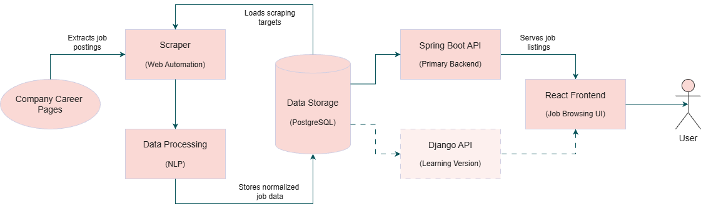
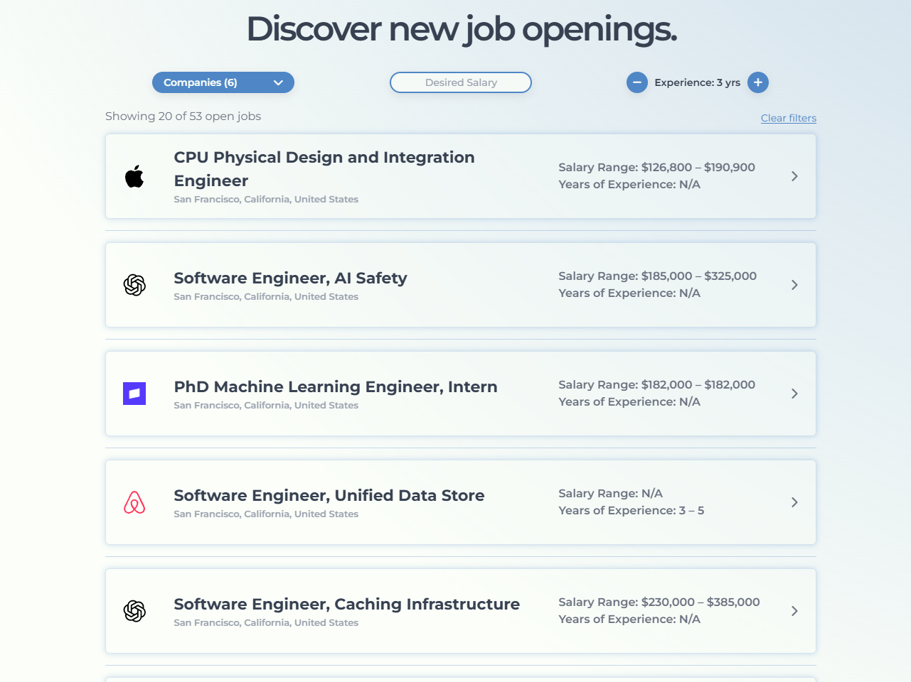

# Jobert 

## Table of Contents
- [System Overview](#system-overview)  
- [Architecture](#architecture)
- [Data Flow](#data-flow)
- [UI Preview](#ui-preview)
- [Tech Stack](#tech-stack)
- [Lessons Learned](#lessons-learned)
- [Future Improvements](#future-improvements)

## Intro
Jobert is a full-stack job aggregation platform that collects software engineering job postings from company career pages that are often missing from major job boards like LinkedIn. By scraping and organizing these listings into a single platform, Jobert makes it easier to find opportunities without having to search through multiple company websites individually. 

## System Overview
- Scraper collects job postings from company career pages
- Spring Boot backend stores and serves structured job data via REST API
- React frontend displays and filters job listings
- Django backend was built as an alternative implementation for learning purposes

## Architecture

## Data Flow
1. Scraping & Extraction
    - Playwright automates navigation of company career pages
    - Job postings are extracted from HTML content
2. Data Processing  
    - SpaCy is used for NLP-based processing of job text
    - Data is cleaned, structured, and normalized
3. Data Storage
    - Processed job data is written to PostgreSQL
    - Database interacts with the scraper and Spring Boot backend
4. Backend Layer
    - Spring Boot exposes REST API for job data
    - DTOs are used to control what data is exposed to the frontend
5. Frontend Layer
    - React fetches job data from backend API
    - Users can browse, filter, and view job details

## UI Preview

## Tech Stack 
### Frontend 
- JavaScript 
- React 
- HTML 
- CSS
- Tailwind 
### Backend (Spring Boot implementation) 
- Spring Boot 
- Java 
- JPA / Hibernate 
- PostgreSQL 
### Data Pipeline (Scraper)
- Python 
- Playwright
- SpaCy
- PostgreSQL
### Backend (Django implementation for learning) 
- Django 
- Python 
### Tools 
- Docker 
- Git 
- Vite 
- Pytest 

## Lessons Learned 
### Modularization and refactoring
One of the biggest lessons from this project was the importance of modularization. As the project scope grew, especially in the scraper, I found myself frequently refactoring code to support new features. I eventually stepped back to restructure the scraper into smaller, reusable components, which significantly reduced future refactoring effort and made development more maintainable.
### Backend design and data modeling
While building the Spring Boot backend, I learned the importance of not exposing full database entities directly to the frontend. Instead, I moved toward using DTOs to control what data is exposed through the API, which improves both performance and security. I also gained a deeper understanding of layered architecture by separating controllers, services, and repositories, which made the system easier to scale and modify.
### Frontend improvements and React hooks
On the frontend, I expanded my understanding of React hooks such as useParams and useRef. useParams allowed me to dynamically load job detail pages based on URL parameters. useRef helped improve user experience by enabling interactions like closing dropdowns when clicking outside of them, making the UI more intuitive.  

## Future Improvements
- Multi-user accounts with saved job tracking
- Email notifications for new postings
- Expanding supported companies
- Location-based filtering and preferences